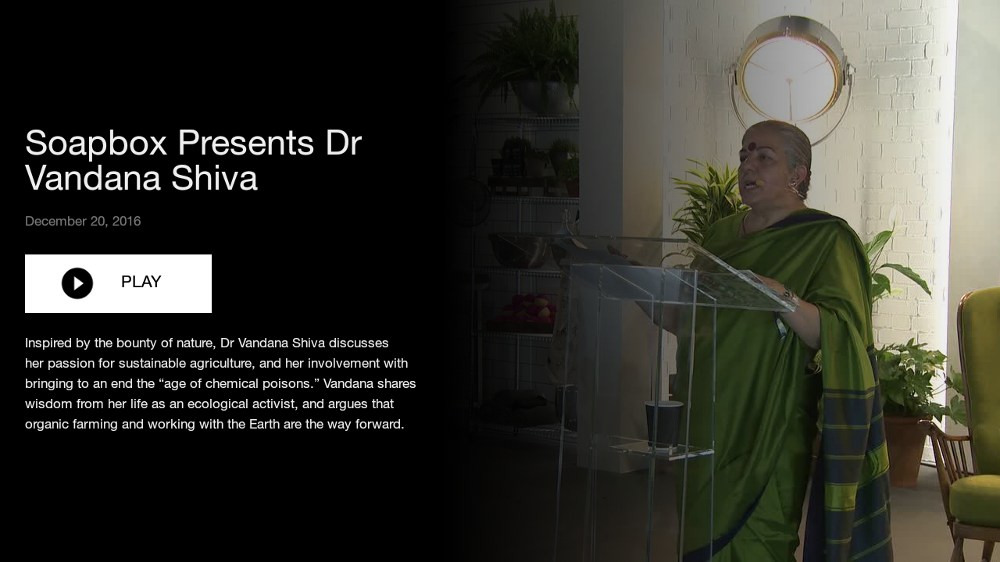

# Lush Player TV/Mobile

Codebase for the Lush Player app, allowing fans to browse and play Lush TV and radio media from its various channels, and to playback live Lush TV.

The API and model objects for interacting with the Lush servers are in the `lib/` submodule. 
Documentation can be found [here]("lib/README.md").

## Setup

* You will need to supply a Brightcove account ID and policy key in the corresponding fields in `lib/src/main/res/values/strings.xml`
* To support crash logging with Fabric Crashlytics you will need to supply a valid Fabric API key in `AndroidManifest.xml`. 
* Run with `./gradlew assembleDebug`

## Screenshots

