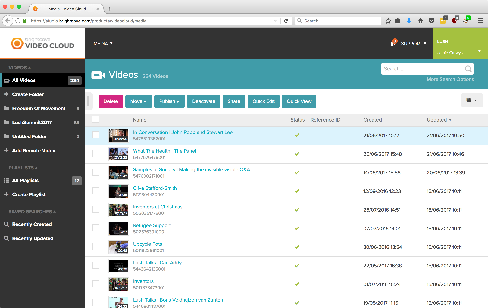
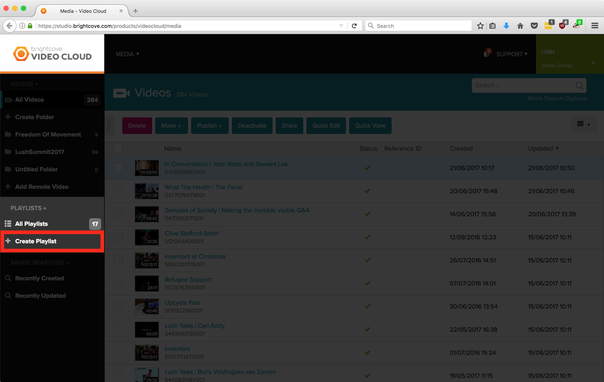
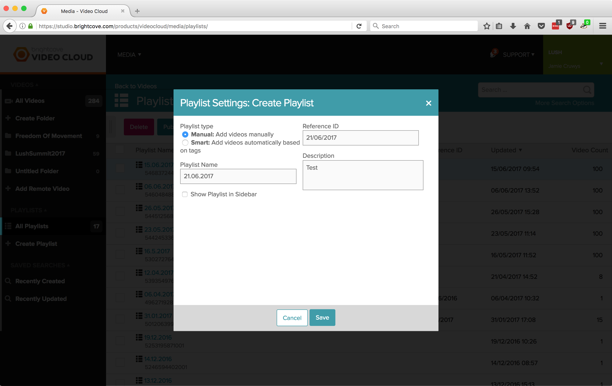
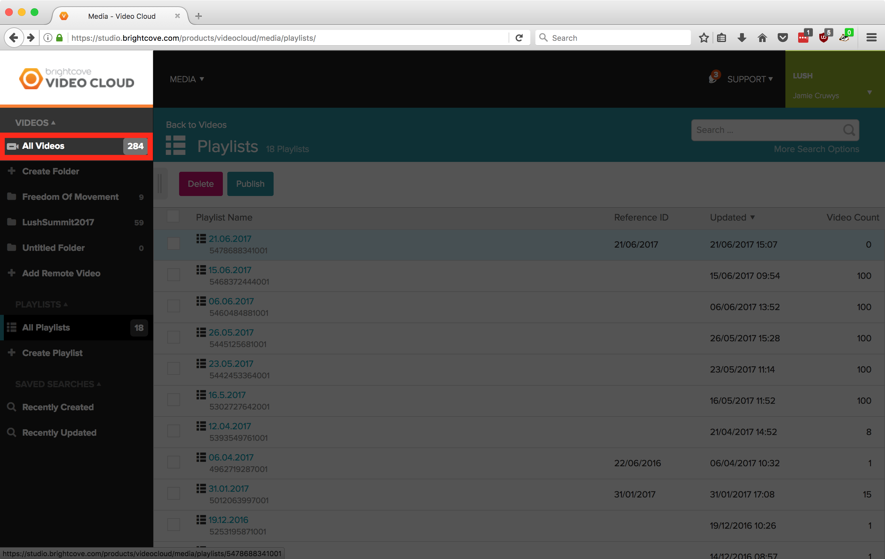
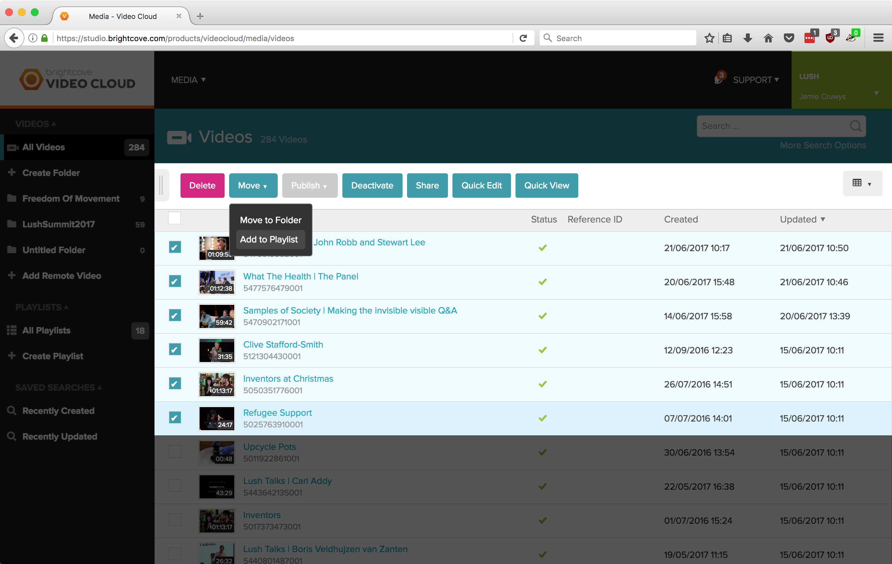
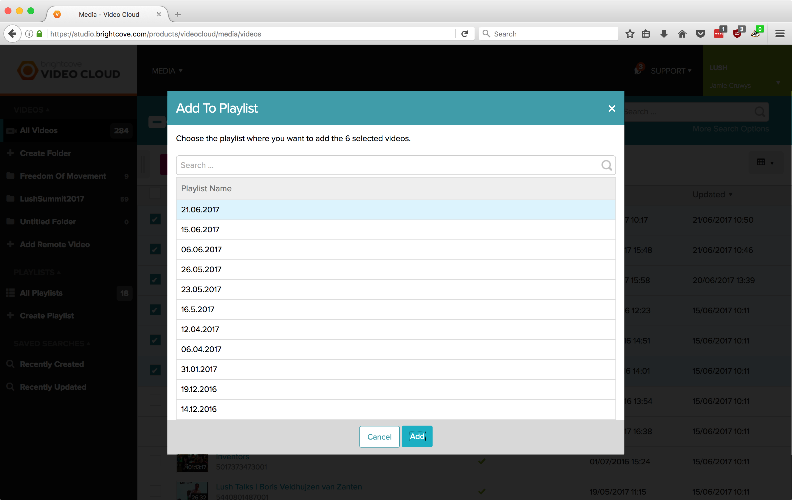
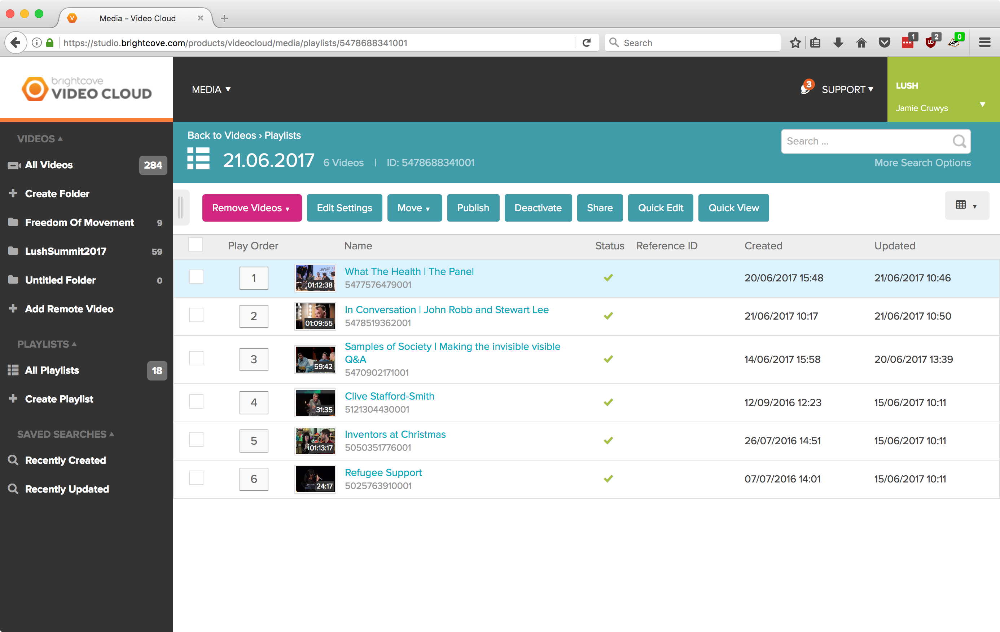
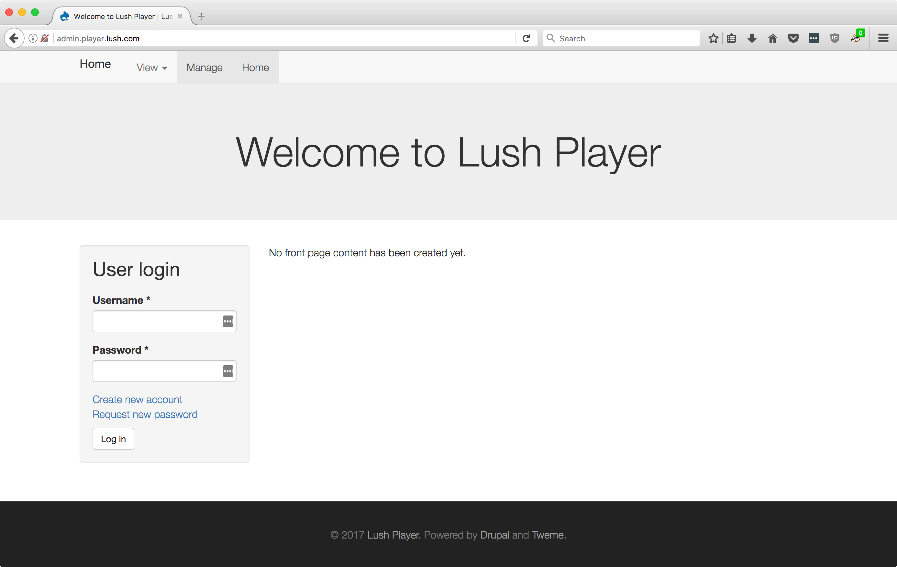
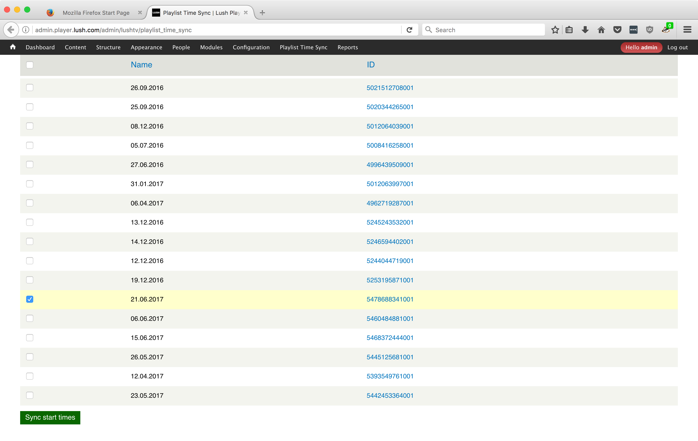
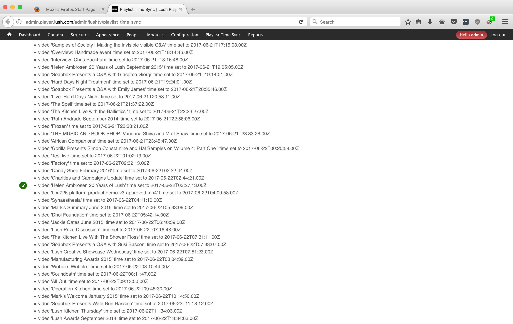

# Live Videos

## Create Playlist in Brightcove

### 1. Login to [Brightcove Video Cloud](https://studio.brightcove.com/products/videocloud/media)

### 2. Click `Create Playlist`

### 3. Fill in playlist fields

* `Playlist Name` must be the date the playlist will be available in the format `DD.MM.YY` e.g. `21.06.2017`
* `Reference ID` can be anything
* `Description` can be anything

Pressing save will show you the following screen

### 4. Click `All Videos`

### 5. Select videos and click `Move` -> `Add to Playlist`

### 6. Select playlist to add videos to

### 7. Check videos are in playlist

## Import playlist into Lush Player Admin / API

### 1. Login to [Lush Player Admin](http://admin.player.lush.com/admin/lushtv/playlist_time_sync)

### 2. Select playlist you wish to make live and click `Sync start times`

### 3. Wait until it finishes loading, showing you all the videos which have been made live

